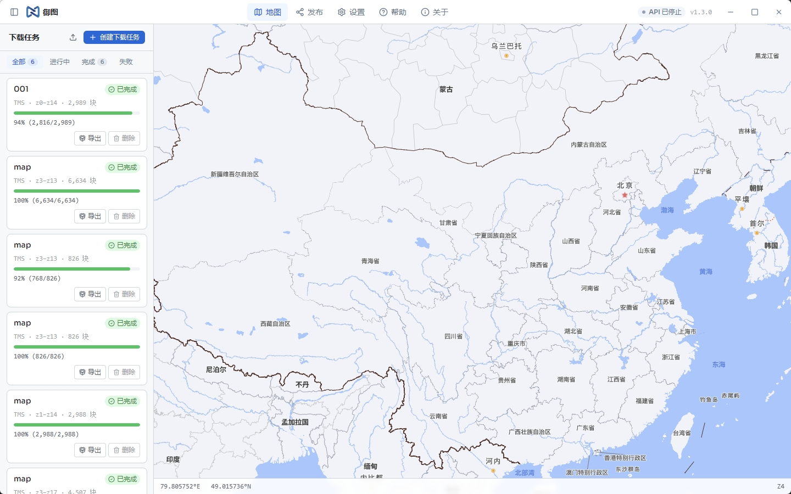

<div align="center">

# 御图

**地图瓦片批量下载与发布工具**

[](LICENSE)
[]()
[](https://tauri.app)
[](https://vuejs.org)



[English](README_EN.md) · 中文

</div>

---

## 简介

御图是一款开源的桌面端地图瓦片下载与管理工具，基于 [Tauri 2](https://tauri.app) + [Vue 3](https://vuejs.org) 构建，支持 Windows、macOS 和 Linux。

它允许用户在可视化地图上圈定区域和层级，然后批量下载对应的瓦片数据，并以多种格式导出或本地发布。

主要使用场景：

- 离线环境下的地图数据预分发
- 将在线地图数据存档为本地文件（MBTiles、GeoTIFF 等）
- 把下载好的瓦片以 TMS/WMTS 服务形式提供给其他应用

---

## 功能特性

### 数据源支持
- **LRC / LRA 文件**：解析奥维互动地图等工具导出的区域文件，自动识别数据地址和范围
- **WMTS 服务**：粘贴 GetCapabilities XML 地址，自动解析图层列表和瓦片范围
- **TMS URL 模板**：输入 `{z}/{x}/{y}` 格式的 URL 模板，即时预览效果
- **网页捕获**：输入任意地图网站地址，自动嗅探页面中的瓦片请求，可视化选择目标图层

### 下载引擎
- 多线程并发下载，速度可控
- 断点续传，网络中断后继续而不重复
- 智能限速与随机延迟，模拟正常浏览行为，降低封禁风险
- User-Agent 轮换
- 实时进度显示，支持悬浮进度条窗口

### 任务管理
- 任务列表侧边栏，一键切换查看各任务的下载范围和已下载内容
- 支持暂停、继续、取消、删除任务
- 外部 `.tgr` 任务文件的导入与导出（SQLite 格式，零拷贝高速传输）

### 导出格式
| 格式                  | 说明                                      |
| --------------------- | ----------------------------------------- |
| 本地文件夹            | 按 `z/x/y.png` 目录结构存储               |
| **MBTiles**           | 单文件数据库，兼容 QGIS / MapTiler 等工具 |
| **GeoTIFF / BigTIFF** | 地理参考栅格图像，支持超大体积（> 4 GB）  |

### 发布服务
- 内置 HTTP 服务器，将本地瓦片以 **TMS** 或 **WMTS** 格式对外发布
- 支持多边形边界裁剪

### 其他
- 自动更新检查，一键下载安装最新版本
- 多语言界面（中文 / English）
- 帮助文档及常见问题内置查阅

---

## 下载安装

前往 [Releases](../../releases/latest) 页面，根据系统下载对应安装包：

| 系统            | 文件              | 说明                          |
| --------------- | ----------------- | ----------------------------- |
| Windows 10/11   | `*_x64-setup.exe` | NSIS 安装包，双击运行         |
| macOS（M 芯片） | `*_aarch64.dmg`   | Apple Silicon                 |
| macOS（Intel）  | `*_x64.dmg`       | x86_64                        |
| Linux           | `*.AppImage`      | 免安装，`chmod +x` 后直接运行 |
| Linux           | `*_amd64.deb`     | Debian / Ubuntu               |

> **macOS 用户**：首次运行如遇 Gatekeeper 拦截，请在「系统设置 → 隐私与安全性」中点击「仍然打开」，或在终端执行：
> ```bash
> xattr -d com.apple.quarantine /Applications/御图.app
> ```

---

## 从源码构建

### 前置依赖

- [Node.js](https://nodejs.org) 18+
- [Rust](https://rustup.rs) stable
- [系统依赖（Linux）](#linux-依赖)

### 步骤

```bash
# 克隆仓库
git clone https://github.com/your-org/tilegrabber.git
cd tilegrabber

# 安装前端依赖
npm install

# 开发模式启动
npm run tauri:dev

# 正式打包
npm run tauri:build
```

### Linux 依赖

```bash
sudo apt-get update
sudo apt-get install -y \
  libwebkit2gtk-4.1-dev \
  libappindicator3-dev \
  librsvg2-dev \
  patchelf
```

---

## 技术栈

| 层          | 技术                        |
| ----------- | --------------------------- |
| 前端框架    | Vue 3 + TypeScript          |
| 地图渲染    | MapLibre GL JS              |
| 区域绘制    | Terra Draw                  |
| UI 组件     | Reka UI + Tailwind CSS v4   |
| 桌面框架    | Tauri 2                     |
| 后端语言    | Rust                        |
| 数据库      | SQLite（rusqlite，bundled） |
| HTTP 客户端 | reqwest（rustls-tls）       |
| 图像处理    | image / tiff crate          |
| 并发        | Tokio + Rayon               |

---

## 项目结构

```
├── src/                  # Vue 前端源码
│   ├── components/
│   │   ├── map/          # 地图相关组件（绘制、进度层、瓦片预览等）
│   │   ├── sidebar/      # 侧边栏（任务列表、下载配置、导出、发布等）
│   │   └── wizard/       # 新建任务向导
│   ├── composables/      # Vue Composables
│   └── locales/          # i18n 语言包
├── src-tauri/            # Rust 后端源码
│   └── src/
│       ├── commands/     # Tauri 命令（任务、下载、导出、发布、更新等）
│       ├── download/     # 下载引擎（多线程、限速、断点续传）
│       ├── export/       # 导出模块（目录、MBTiles、GeoTIFF）
│       ├── parser/       # 数据解析（LRC/LRA、WMTS、网页捕获）
│       └── server/       # 内置 TMS/WMTS HTTP 服务
└── .github/workflows/    # CI/CD 流水线
```

---

## 参与贡献

欢迎 Issue 和 Pull Request！提交 PR 前请确保：

1. `npm run build` 前端构建通过
2. `cargo check` Rust 编译通过
3. 代码风格与现有代码保持一致

---

## 许可证

本项目采用 [MIT License](LICENSE)。
