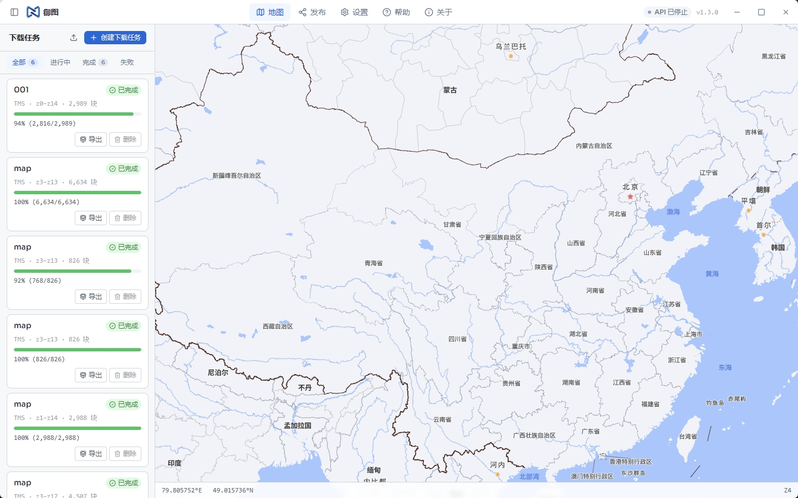

<div align="center">

# TileGrabber (御图)

**Map Tile Batch Downloader & Publisher**

[](LICENSE)
[]()
[](https://tauri.app)
[](https://vuejs.org)



[中文](README.md) · English

</div>

---

## Overview

TileGrabber is an open-source desktop application for downloading and managing map tiles, built with [Tauri 2](https://tauri.app) + [Vue 3](https://vuejs.org). It runs natively on Windows, macOS, and Linux.

Draw an area on the interactive map, choose zoom levels, and TileGrabber downloads all corresponding tiles from any supported source — then export or serve them locally in multiple formats.

**Common use cases:**

- Pre-distributing map data for offline environments
- Archiving online map data as local files (MBTiles, GeoTIFF, etc.)
- Serving downloaded tiles as a local TMS/WMTS service for other applications

---

## Features

### Data Sources

- **LRC / LRA files** — Parse region files exported by tools such as Oruxmaps; auto-detects the tile URL and bounding area
- **WMTS services** — Paste a GetCapabilities XML URL; TileGrabber parses available layers and tile extents automatically
- **TMS URL templates** — Enter a `{z}/{x}/{y}` template URL and previews tiles immediately
- **Web capture** — Enter any map website URL; TileGrabber sniffs tile requests from the page and lets you pick the target layer visually

### Download Engine

- Multi-threaded concurrent downloading with configurable concurrency
- Resume interrupted downloads — no duplicate requests after a network failure
- Intelligent rate limiting with randomised delays to mimic natural browsing and reduce ban risk
- User-Agent rotation
- Real-time progress display, including a compact floating progress window
- **Streaming clip pipeline**: when "Strict clip to task bounds" is enabled on a raster (non-GCJ02) task, boundary tiles are pixel-clipped concurrently while downloading — the task finishes ready-to-use with no separate "clipping" stage

### Task Management

- Sidebar task list with one-click switching between tasks — view download bounds and tile coverage on the map
- Pause, resume, cancel, or delete tasks at any time
- Import and export tasks as `.tgr` files (SQLite-based binary format, zero-copy fast transfer)

### Tile Types

- **Raster tiles** — PNG / JPEG / WebP; full support for download, preview, clipping, and all export formats
- **Vector tiles (MVT / PBF)** — Sources containing `pbf` / `mvt` / `vector` keywords are auto-detected; the download pipeline skips pixel post-processing (GCJ-02 shift correction, tile_clip); preview auto-generates a grayscale skeleton style (fill + line + circle); exportable to MBTiles (with `vector_layers` metadata + automatic gzip) and PMTiles (`TileType::Mvt` + `Compression::Gzip`)

### Export Formats

| Format                | Description                                                                       |
| --------------------- | --------------------------------------------------------------------------------- |
| Directory             | Tiles stored as `z/x/y.png` folder hierarchy                                      |
| **MBTiles**           | Single-file SQLite database; compatible with QGIS, MapTiler, etc.; vector-capable |
| **PMTiles**           | Cloud-native single-file format with HTTP Range support; vector-capable           |
| **GeoTIFF / BigTIFF** | Georeferenced raster image; supports files larger than 4 GB; raster only          |

### Publishing

- Built-in HTTP server to publish local tiles via multiple standard protocols:
  - **XYZ (TMS)** — Standard tile URL template (`{z}/{x}/{y}`)
  - **WMTS 1.0.0** — OGC Web Map Tile Service; compatible with Cesium, ArcGIS, QGIS, etc.
  - **WMS 1.1.1** — OGC Web Map Service; supports GetCapabilities and GetMap (EPSG:4326 / EPSG:3857)
  - **OGC API Tiles** — Next-generation OGC REST API; compatible with MapLibre GL JS and modern clients
  - **ArcGIS REST API** — Compatible with the Esri ecosystem (ArcGIS Online, Esri Leaflet, etc.)
- LAN access: auto-detects local IP addresses; select an address from the dropdown and all service URLs update instantly
- Per-protocol request statistics (XYZ / WMTS / WMS live request counts)
- Built-in code examples for Cesium.js, Leaflet.js, and MapLibre GL JS

### Other

- Automatic update checks with one-click download and install
- Multi-language UI (Chinese / English)
- Built-in help documentation and FAQ

---

## Download & Install

Go to the [Releases](../../releases/latest) page and download the package for your platform:

| Platform              | File              | Notes                                   |
| --------------------- | ----------------- | --------------------------------------- |
| Windows 10/11         | `*_x64-setup.exe` | NSIS installer, double-click to run     |
| macOS (Apple Silicon) | `*_aarch64.dmg`   | M-series chips                          |
| macOS (Intel)         | `*_x64.dmg`       | x86_64                                  |
| Linux                 | `*.AppImage`      | No install needed; run `chmod +x` first |
| Linux                 | `*_amd64.deb`     | Debian / Ubuntu                         |

> **macOS users**: If Gatekeeper blocks the app on first launch, go to **System Settings → Privacy & Security** and click **Open Anyway**, or run:
>
> ```bash
> xattr -d com.apple.quarantine /Applications/TileGrabber.app
> ```

---

## Build from Source

### Prerequisites

- [Node.js](https://nodejs.org) 18+
- [Rust](https://rustup.rs) stable toolchain
- [System dependencies (Linux only)](#linux-dependencies)

### Steps

```bash
# Clone the repository
git clone https://github.com/your-org/tilegrabber.git
cd tilegrabber

# Install frontend dependencies
npm install

# Start in development mode
npm run tauri:dev

# Build a release package
npm run tauri:build
```

### Linux Dependencies

```bash
sudo apt-get update
sudo apt-get install -y \
  libwebkit2gtk-4.1-dev \
  libappindicator3-dev \
  librsvg2-dev \
  patchelf
```

### Self-hosted Release Channel After Fork (Updater Signing)

TileGrabber uses [tauri-plugin-updater](https://v2.tauri.app/plugin/updater/) for end-to-end minisign signing, so the auto-update channel can't be tampered with. **After forking**, if you want to enable auto-update, you must use your own key pair:

```bash
# 1. Generate your own key pair (run once on your local machine)
npx tauri signer generate -w "$HOME/.tauri/yourproject.key"
# Windows PowerShell:
# npx tauri signer generate -w "$env:USERPROFILE\.tauri\yourproject.key"
```

This produces:

- A `.key` file — your **private key**. Never commit or share it.
- A base64 string printed to the console — your **public key**.

Then:

1. Put the **entire content** of the `.key` file into your repo secret `TAURI_SIGNING_PRIVATE_KEY`
2. Put the **password** you entered during generation into repo secret `TAURI_SIGNING_PRIVATE_KEY_PASSWORD`
3. Paste the **public key** string into `src-tauri/tauri.conf.json` → `plugins.updater.pubkey`
4. Keep one offline backup of the `.key` file (USB drive / password manager)

> ⚠️ Losing the private key is unrecoverable: existing clients will reject any update signed with a new key, so every user must manually download a fresh build.

---

## Tech Stack

| Layer              | Technology                 |
| ------------------ | -------------------------- |
| Frontend framework | Vue 3 + TypeScript         |
| Map rendering      | MapLibre GL JS             |
| Area drawing       | Terra Draw                 |
| UI components      | Reka UI + Tailwind CSS v4  |
| Desktop shell      | Tauri 2                    |
| Backend language   | Rust                       |
| Database           | SQLite (rusqlite, bundled) |
| HTTP client        | reqwest (rustls-tls)       |
| Image processing   | image / tiff crates        |
| Concurrency        | Tokio + Rayon              |

---

## Project Structure

```
├── src/                  # Vue frontend source
│   ├── components/
│   │   ├── map/          # Map components (drawing, progress layer, tile preview, etc.)
│   │   ├── sidebar/      # Sidebar panels (tasks, download config, export, publish, etc.)
│   │   └── wizard/       # New task wizard
│   ├── composables/      # Vue composables
│   └── locales/          # i18n locale files
├── src-tauri/            # Rust backend source
│   └── src/
│       ├── commands/     # Tauri commands (tasks, download, export, publish, updater, etc.)
│       ├── download/     # Download engine (multi-thread, throttle, resume)
│       ├── export/       # Export modules (directory, MBTiles, PMTiles, GeoTIFF)
│       ├── parser/       # Parsers (LRC/LRA, WMTS, web capture)
│       └── server/       # Built-in TMS/WMTS HTTP server
└── .github/workflows/    # CI/CD pipelines
```

---

## Contributing

Issues and pull requests are welcome! Before submitting a PR, please ensure:

1. `npm run build` completes without errors
2. `cargo check` passes in `src-tauri/`
3. Code style is consistent with the existing codebase

---

## License

This project is licensed under the [MIT License](LICENSE).
