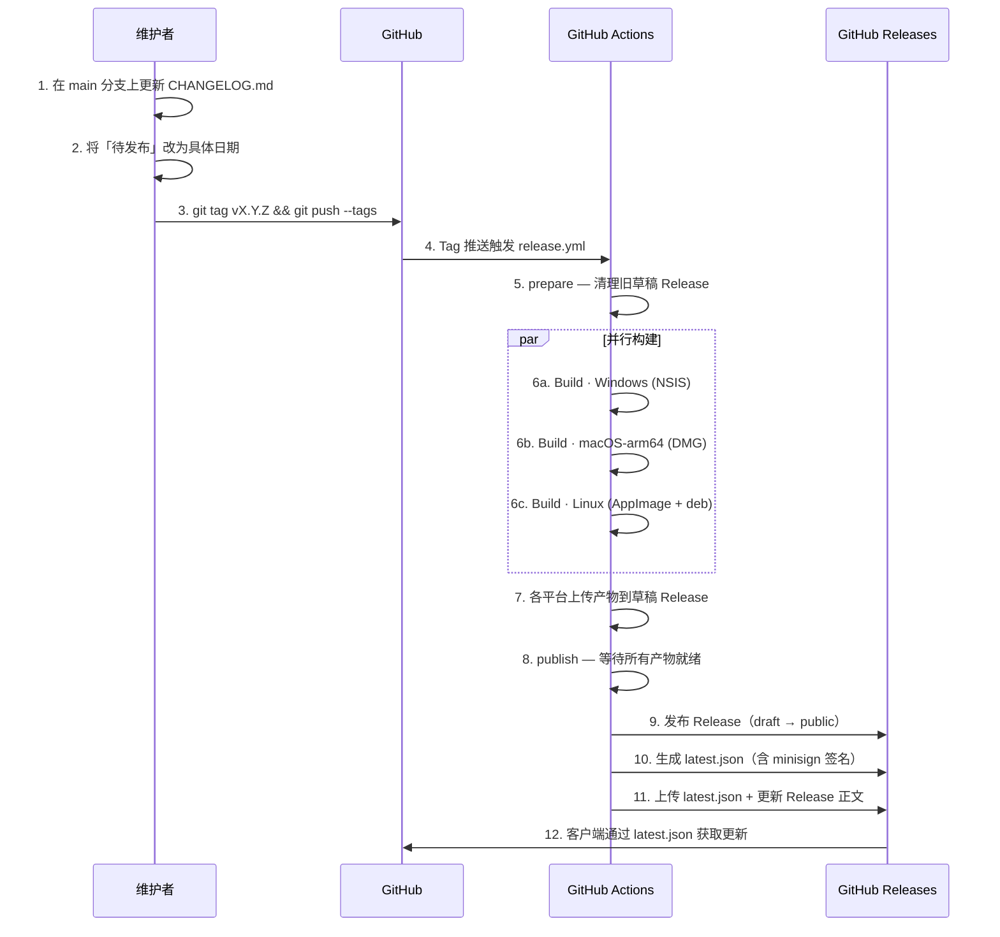

# 贡献指南 — TileGrabber (御图)

本文档说明本项目的**提交流水线**（Commit Pipeline）与**更新日志**（CHANGELOG）编写流程，面向所有贡献者。

---

## 目录

- [分支策略](#分支策略)
- [提交流水线](#提交流水线)
- [更新日志规范](#更新日志规范)
- [发布流程全景](#发布流程全景)
- [Fork 后自建发布通道](#fork-后自建发布通道)

---

## 分支策略

| 分支     | 用途                                    |
| -------- | --------------------------------------- |
| `main`   | 主分支，始终保持可发布状态              |
| `feat/*` | 功能分支，从 `main` 切出，合并回 `main` |

本项目未使用 `develop` 分支，所有修改最终合并到 `main` 后通过 **Tag 触发发布**。

---

## 提交流水线

### 第 1 步：切分支

```bash
git checkout main
git pull origin main
git checkout -b feat/my-feature
```

### 第 2 步：本地开发

- **前端** (`src/`)：`npm run dev`（端口 4000）
- **完整桌面应用**：`npm run tauri:dev`
- **Rust 编译检查**：在 `src-tauri/` 内运行 `cargo check`

### 第 3 步：编写 CHANGELOG

**在提交代码的同时更新 `CHANGELOG.md`**。在文件顶部的 `## [vX.Y.Z] - 待发布` 段落中追加你的变更条目。

条目分类（详见[更新日志规范](#更新日志规范)）：

```
### 新增        — 新功能
### 修复        — Bug 修复
### 优化        — 性能 / 体验改进
### 安全        — 安全相关修复
### 破坏性变更  — 不向后兼容的改动
```

### 第 4 步：提交与推送

```bash
git add .
git commit -m "feat: 功能简述"
git push origin feat/my-feature
```

### 第 5 步：创建 Pull Request

在 GitHub 上创建 PR，指向 `main` 分支。CI 不会自动运行（本项目仅在 Tag 推送时触发 CI 构建），但 PR 是代码审查的入口。

### 第 6 步：合并后发布

PR 合并到 `main` 后，由维护者打 Tag 触发发布。详见下方[发布流程全景](#发布流程全景)。

---

## 更新日志规范

### 格式

`CHANGELOG.md` 遵循 [Keep a Changelog](https://keepachangelog.com/zh-CN/1.0.0/) 规范，语义化版本。

### 版本段落结构

每个版本以 `## [vX.Y.Z] - 日期` 为标题，变更按分类组织：

```markdown
## [v0.5.0] - 待发布

### 安全

- **核心变更简述**：详细说明。可跨多行。

### 新增

- **功能名**：功能描述
  - **子项**：实现细节
  - **子项**：依赖变化

### 修复

- **问题简述**：修复说明

### 破坏性变更

- **变更内容**：迁移指引
```

### 编写规则

1. **发布前条目放在 `- 待发布` 版本中**。CI 在打 Tag 时会自动将 `CHANGELOG.md` 中对应版本的条目提取到 Release 正文。
2. **已发布的版本**：标题中 `待发布` 替换为实际日期（如 `2026-04-29`）。
3. **条目粒度**：面向用户可感知的变更。纯内部重构（如"重命名变量"）不必写入。
4. **破坏性变更必须写清迁移路径**：若有 API 变更，说明旧行为、新行为、如何适配。
5. **安全相关单独归类**：任何安全修复或加固单独归入 `### 安全`。

### CI 如何读取 CHANGELOG

CI（`release.yml` 的 `publish` job）通过 `awk` 提取对应版本的内容：

```bash
NOTES=$(awk -v ver="v0.5.0" '
  /^## \[/ { if (found) exit; if (index($0, "[" ver "]") > 0) { found=1; next } }
  found { print }
' CHANGELOG.md)
```

这意味着：

- 标题行 `## [vX.Y.Z]` 必须严格匹配 Tag 名（去掉 `v` 前缀后的版本号）。
- 下一个 `## [...]` 标题行自动作为版本段落的终止边界。
- `---` 分隔线和空行会被自动过滤。

---

## 发布流程全景

发布由 **Git Tag** 触发，全程自动化。以下为完整流水线：



### 各阶段详解

#### 阶段 1–3：触发

```bash
# 1. 确保 CHANGELOG.md 中版本标题已更新为日期
#    ## [v0.5.0] - 2026-06-02

# 2. 提交 CHANGELOG 更新
git add CHANGELOG.md
git commit -m "chore: v0.5.0 发布"

# 3. 打 Tag 并推送
git tag v0.5.0
git push origin main --tags
```

> **手动触发**：也可在 GitHub Actions → "打包发布" → `Run workflow`，手动指定 Tag 名。

#### 阶段 4–5：准备

- `prepare` job 删除同 Tag 的旧草稿 Release，确保 tauri-action 创建全新 Release。

#### 阶段 6：并行构建（`build` job，矩阵策略）

| 平台      | Runner           | 产物                                                                 |
| --------- | ---------------- | -------------------------------------------------------------------- |
| Windows   | `windows-latest` | `*_x64-setup.exe` + `.exe.sig`                                       |
| macOS ARM | `macos-latest`   | `*_aarch64.dmg` + `.app.tar.gz` + `.app.tar.gz.sig`                  |
| Linux     | `ubuntu-22.04`   | `*.AppImage` + `.AppImage.tar.gz` + `.AppImage.tar.gz.sig` + `*.deb` |

构建时自动将 `Cargo.toml` 的 `version` 字段同步为 Tag 版本号（去掉 `v` 前缀），确保 `CARGO_PKG_VERSION` 与发布 Tag 一致。

构建通过 `tauri-apps/tauri-action@v0` 完成，产物以**草稿**（draft）状态上传到 Release。

#### 阶段 7–8：等待产物

`publish` job 等待所有三平台产物上传完成（最长 10 分钟），轮询间隔 20 秒。

#### 阶段 9：发布

```bash
gh release edit "$TAG" --draft=false
```

将 Release 从草稿转为公开。**这一步必须在获取产物 URL 之前完成**，否则 `latest.json` 中的下载地址会指向 `untagged-{sha}` 格式的临时 URL（404）。

#### 阶段 10：生成 `latest.json`

CI 从 Release 产物列表中提取：

- 各平台的 **安装包 URL**（旧 schema `assets` 字段）
- 各平台的 **更新专用产物 URL + minisign 签名**（新 schema `platforms` 字段）

最终生成的 `latest.json` 结构：

```json
{
  "version": "0.5.0",
  "notes": "（来自 CHANGELOG.md 的变更内容）",
  "pub_date": "2026-06-02T12:00:00Z",
  "platforms": {
    "windows-x86_64": {
      "signature": "（minisign 签名内容）",
      "url": "https://github.com/.../TileGrabber_0.5.0_x64-setup.exe"
    },
    "darwin-aarch64": {
      "signature": "（minisign 签名内容）",
      "url": "https://github.com/.../TileGrabber_0.5.0_aarch64.app.tar.gz"
    },
    "linux-x86_64": {
      "signature": "（minisign 签名内容）",
      "url": "https://github.com/.../TileGrabber_0.5.0_amd64.AppImage.tar.gz"
    }
  }
}
```

#### 阶段 11–12：发布完成

- `latest.json` 上传到 Release 资产
- Release 正文更新为「CHANGELOG 内容 + 下载表格」
- 客户端应用通过 `tauri-plugin-updater` 自动检查 `latest.json`，验证 minisign 签名后提示更新

---

## Fork 后自建发布通道

若你 Fork 了本仓库并希望独立发布，需要在你的仓库中配置以下 Secrets：

| Secret                               | 说明                              |
| ------------------------------------ | --------------------------------- |
| `TAURI_SIGNING_PRIVATE_KEY`          | minisign 私钥（用于签名更新产物） |
| `TAURI_SIGNING_PRIVATE_KEY_PASSWORD` | 私钥密码（可空）                  |

生成密钥对：

```bash
# 安装 minisign（如 Windows: scoop install minisign）
minisign -G -W
```

公钥需写入 `src-tauri/tauri.conf.json` 的 `plugins.updater.pubkey` 字段。私钥作为 GitHub Secret 存入仓库。

---

## 快速检查清单

发布前请确认：

- [ ] `CHANGELOG.md` 中「待发布」段落的条目已完整、分类正确
- [ ] 版本标题已从 `- 待发布` 改为具体日期
- [ ] 如有破坏性变更，已写明迁移路径
- [ ] `src-tauri/Cargo.toml` 的 `version` 无需手动更新（CI 自动同步）
- [ ] Tag 名格式为 `v` + 语义化版本号（如 `v0.5.0`）
- [ ] 推送 Tag 后等待 CI 完成（全部三平台构建 + `publish` job）
